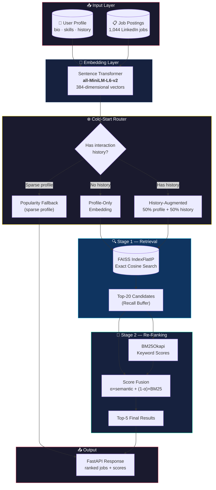
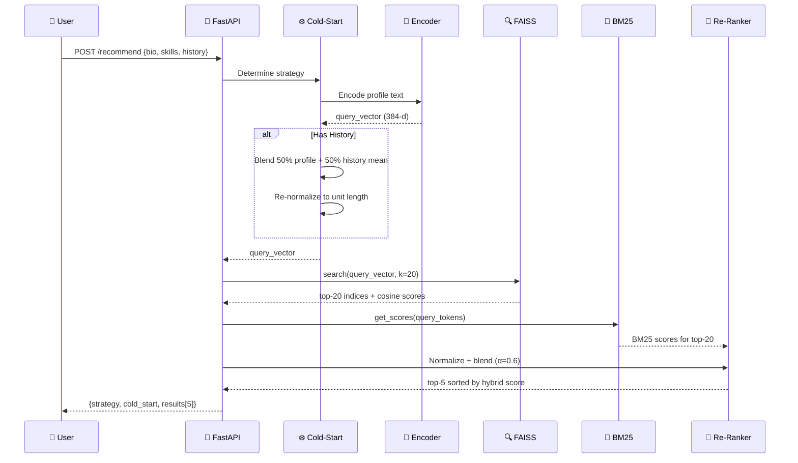
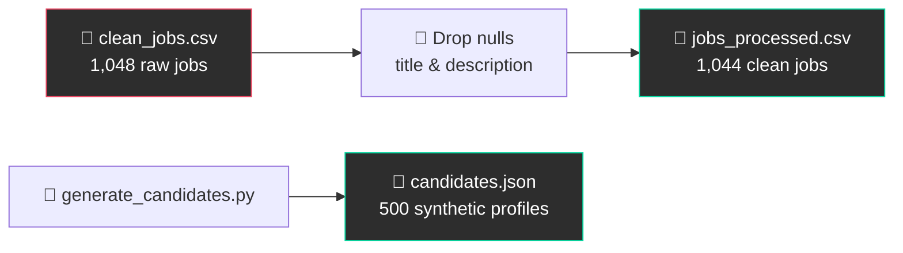
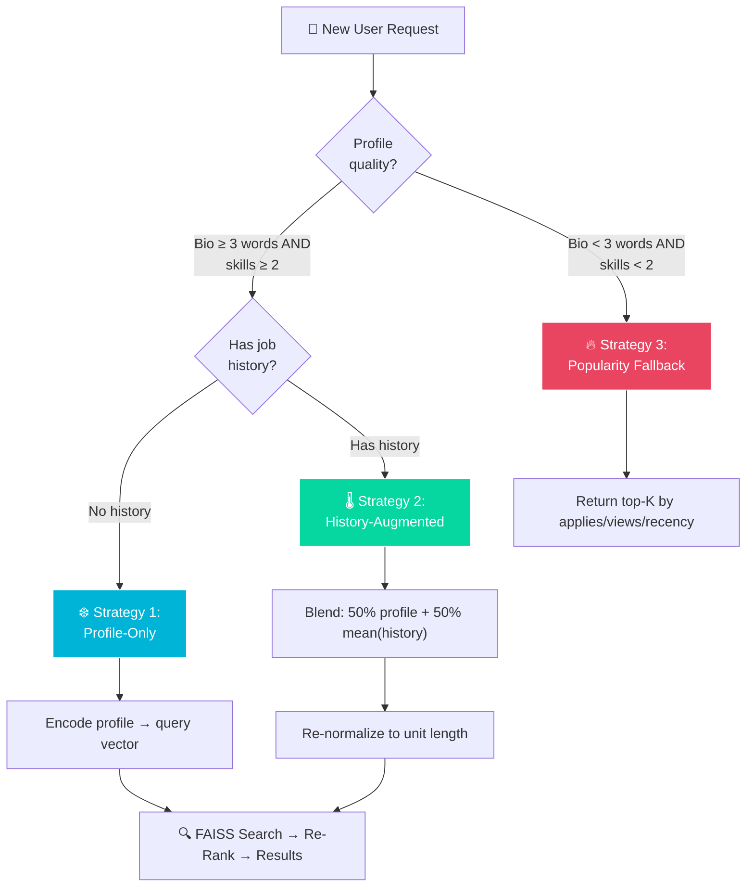

<div align="center">

# 🎯 Semantic Job Matchmaking Engine

### A Two-Stage Retrieval + Re-Ranking System for Intelligent Job Recommendations

[](https://python.org)
[](https://fastapi.tiangolo.com)
[](https://github.com/facebookresearch/faiss)
[](https://www.sbert.net)
[](LICENSE)

*Match job seekers to their ideal positions using dense semantic embeddings, approximate nearest-neighbour search, and hybrid keyword-aware re-ranking — with built-in cold-start handling.*

---

[Features](#-key-features) · [Architecture](#-system-architecture) · [Quick Start](#-quick-start) · [API Reference](#-api-reference) · [Evaluation](#-evaluation-results) · [How It Works](#-how-it-works-detailed)

</div>

---

## 📖 Table of Contents

- [Key Features](#-key-features)
- [System Architecture](#-system-architecture)
- [Project Structure](#-project-structure)
- [Definitions & Concepts](#-definitions--concepts)
- [Quick Start](#-quick-start)
- [Pipeline Walkthrough](#-pipeline-walkthrough)
- [API Reference](#-api-reference)
- [Cold-Start Strategies](#-cold-start-strategies)
- [Evaluation Results](#-evaluation-results)
- [How It Works (Detailed)](#-how-it-works-detailed)
- [Dataset](#-dataset)
- [Tech Stack](#-tech-stack)
- [Future Improvements](#-future-improvements)

---

## ✨ Key Features

| Feature | Description |
|---|---|
| **🔍 Semantic Search** | Dense 384-dim embeddings via `all-MiniLM-L6-v2` capture meaning beyond keywords |
| **⚡ FAISS Index** | Exact inner-product search over normalized vectors (cosine similarity) in milliseconds |
| **🔀 Hybrid Re-ranking** | BM25 keyword scoring blended with semantic scores (α=0.6) for precision |
| **❄️ Cold-Start Handling** | Three strategies: profile-only, history-augmented, and popularity fallback |
| **🚀 REST API** | Production-ready FastAPI endpoint with Swagger docs, validation, and health checks |
| **📊 Offline Evaluation** | Automated NDCG@5 and Precision@5 metrics with heuristic ground truth |
| **🏭 Synthetic Data** | 500 diverse candidate profiles across 20 roles and 10 skill domains |

---

## 🏗 System Architecture



### Pipeline Flow (Step-by-Step)



---

## 📁 Project Structure

```
Semantic-job-matchmaking-engine/
│
├── 📂 data/
│   ├── candidates.json              # 500 synthetic candidate profiles (tracked)
│   ├── clean_jobs.csv               # Raw LinkedIn dataset (git-ignored, download from Kaggle)
│   └── jobs_processed.csv           # Cleaned job postings — 1,044 rows (git-ignored, regenerable)
│
├── 📂 embeddings/                   # Git-ignored — regenerated by embed.py
│   ├── job_embeddings.npy           # Pre-computed job vectors (1044 × 384)
│   └── candidate_embeddings.npy     # Pre-computed candidate vectors (500 × 384)
│
├── 📂 index/                        # Git-ignored — regenerated by retrieval.py
│   └── job_index.faiss              # Serialised FAISS inner-product index
│
├── 📂 notebooks/
│   └── semantic-job-matching.ipynb   # Original Kaggle development notebook
│
├── 📂 scripts/
│   └── generate_candidates.py       # Synthetic candidate profile generator
│
├── embed.py                         # Embedding pipeline (encode jobs + candidates)
├── retrieval.py                     # FAISS index build, save, load, search
├── rerank.py                        # BM25 hybrid re-ranking module
├── cold_start.py                    # Cold-start query vector strategies
├── api.py                           # FastAPI REST endpoint
├── evaluate.py                      # Offline evaluation (NDCG@5, Precision@5)
├── metrics.json                     # Latest evaluation results
├── requirements.txt                 # Python dependencies
├── LICENSE                          # MIT License
├── .gitignore                       # Git exclusion rules
└── README.md                        # This documentation
```

---

## 📚 Definitions & Concepts

Understanding the building blocks behind this system:

### Core NLP & IR Concepts

| Term | Definition |
|---|---|
| **Semantic Search** | A search technique that understands the *meaning* (semantics) of a query rather than just matching exact keywords. For example, searching "ML engineer" also retrieves jobs mentioning "machine learning specialist" because they share the same meaning in the embedding space. |
| **Dense Embedding** | A fixed-length numerical vector (in our case 384 floats) that encodes the semantic meaning of a piece of text. Every word, phrase, or paragraph is compressed into this dense vector, where similar meanings end up as nearby points in the vector space. |
| **Sparse Representation** | A text representation where most values are zero (e.g., TF-IDF or BM25 term vectors). Each dimension corresponds to a vocabulary word. Sparse methods are great at exact keyword matching but miss synonyms. |
| **Bi-Encoder** | A neural architecture where query and document are encoded *independently* into separate vectors. Similarity is computed via dot product or cosine — enabling pre-computation and fast retrieval. Our `all-MiniLM-L6-v2` model is a bi-encoder. |
| **Cosine Similarity** | A measure of angle-based similarity between two vectors, ranging from −1 (opposite) to +1 (identical). For L2-normalized vectors, cosine similarity equals the inner (dot) product: `cos(A, B) = A · B`. |
| **BM25 (Best Match 25)** | A probabilistic ranking function from the Okapi information retrieval system. It scores documents by term frequency (TF), inverse document frequency (IDF), and document length normalization. BM25 excels at exact keyword matching. |

### Retrieval & Ranking

| Term | Definition |
|---|---|
| **Two-Stage Retrieval** | A paradigm where: (1) a fast *retriever* casts a wide net (top-K candidates), then (2) a more expensive *re-ranker* refines the order. This balances speed with precision. |
| **Recall Buffer** | The over-fetched set of candidates from Stage 1 (we use k=20) that gives the re-ranker enough material to work with. A larger buffer increases recall at the cost of re-ranking time. |
| **Hybrid Scoring** | Combining multiple signals (semantic + keyword) into a single score: `hybrid = α × semantic + (1−α) × BM25`. We use α=0.6, weighting semantic understanding higher while still rewarding exact keyword matches. |
| **Min-Max Normalization** | Rescaling scores to the [0, 1] range: `norm(x) = (x − min) / (max − min)`. Applied to both semantic and BM25 scores before blending so neither signal dominates due to scale differences. |
| **FAISS (Facebook AI Similarity Search)** | A library by Meta AI for efficient similarity search over dense vectors. Our `IndexFlatIP` performs *exact* inner-product search — no approximation, perfect recall. |
| **IndexFlatIP** | A FAISS index type that stores all vectors in a flat (brute-force) structure and computes inner products exhaustively. "IP" = Inner Product. Ideal for datasets under ~100K vectors. |

### Cold-Start Problem

| Term | Definition |
|---|---|
| **Cold-Start Problem** | The challenge of making recommendations for a new user (or item) with no interaction history. Without past behaviour data, the system must rely on profile attributes alone. |
| **Profile-Only Strategy** | For new users: encode their bio + skills + desired role into a query vector. No historical signal — purely content-based matching. |
| **History-Augmented Strategy** | For returning users: blend 50% profile embedding + 50% mean of embeddings from previously interacted jobs. This captures both stated preferences and revealed preferences. |
| **Popularity Fallback** | For extremely sparse profiles (< 3 words in bio AND < 2 skills): bypass semantic search entirely and return the most applied-to or most viewed jobs as a safe default. |

### Evaluation Metrics

| Metric | Definition | Our Result |
|---|---|---|
| **NDCG@K** | Measures ranking quality by assigning higher importance to relevant results appearing earlier. A perfect ranking scores 1.0; random ranking ≈ 0.0. The "discounting" penalises relevant results that appear lower in the list. | **0.5196** |
| **Precision@K** | The fraction of the top-K recommended jobs that are actually relevant: `Precision@5 = (relevant in top-5) / 5`. Simple and interpretable. | **0.2292** |
| **Ground Truth (Heuristic)** | Since we lack real user-job interaction data, we construct synthetic relevance labels: a job is "relevant" to a candidate if the description mentions ≥ 2 of the candidate's skills (case-insensitive). | — |

### Model & Embeddings

| Term | Definition |
|---|---|
| **all-MiniLM-L6-v2** | A lightweight sentence-transformer model (22M parameters, 6 layers) from the Sentence-Transformers library. It maps text to 384-dimensional dense vectors. Trained on 1B+ sentence pairs for semantic textual similarity. |
| **Sentence-Transformers** | A Python framework for state-of-the-art text embeddings, built on top of Hugging Face Transformers. Provides pre-trained models optimised for semantic similarity and retrieval tasks. |
| **L2 Normalization** | Scaling a vector to unit length: `v̂ = v / ‖v‖`. After normalization, the inner product of two vectors equals their cosine similarity, which simplifies FAISS search. |

---

## 🚀 Quick Start

### Prerequisites

- **Python 3.10+**
- **pip** (package manager)
- ~2 GB disk space (for model weights + embeddings)

### 1. Clone the Repository

```bash
git clone https://github.com/<your-username>/Semantic-job-matchmaking-engine.git
cd Semantic-job-matchmaking-engine
```

### 2. Create Virtual Environment (Recommended)

```bash
python -m venv venv
source venv/bin/activate  # On Windows: venv\Scripts\activate
```

### 3. Install Dependencies

```bash
pip install -r requirements.txt
```

### 4. Obtain the Dataset

This project uses the [LinkedIn Data Jobs Dataset](https://www.kaggle.com/datasets/joykimaiyo18/linkedin-data-jobs-dataset) from Kaggle.

**Option A — Kaggle CLI:**

```bash
pip install kaggle
kaggle datasets download -d joykimaiyo18/linkedin-data-jobs-dataset
unzip linkedin-data-jobs-dataset.zip -d data/
```

**Option B — Manual Download:**

1. Visit the [dataset page](https://www.kaggle.com/datasets/joykimaiyo18/linkedin-data-jobs-dataset)
2. Download `clean_jobs.csv`
3. Place it in `data/clean_jobs.csv`

### 5. Run the Full Pipeline

```bash
# Step 1: Generate synthetic candidates (500 profiles)
python scripts/generate_candidates.py

# Step 2: Encode all texts into dense embeddings (~5 min on CPU)
python embed.py

# Step 3: Build the FAISS search index
python retrieval.py

# Step 4: Evaluate the system
python evaluate.py

# Step 5: Start the API server
uvicorn api:app --reload
```

### 6. Test the API

```bash
# Health check
curl http://localhost:8000/health

# Get recommendations
curl -X POST http://localhost:8000/recommend \
  -H "Content-Type: application/json" \
  -d '{
    "bio": "Senior machine learning engineer with 5 years of NLP experience",
    "skills": ["Python", "PyTorch", "NLP", "Transformers", "Docker"],
    "experience_years": 5,
    "desired_role": "Machine Learning Engineer",
    "history": []
  }'
```

Visit **http://localhost:8000/docs** for the interactive Swagger UI.

---

## 🔄 Pipeline Walkthrough

### Stage 0 — Data Preparation



The raw LinkedIn dataset is cleaned by dropping rows with missing titles or descriptions (1,048 → 1,044 rows). Synthetic candidates are generated with realistic distributions across 20 roles and 10 skill domains.

### Stage 1 — Embedding (`embed.py`)

Each job and candidate is converted into a 384-dimensional dense vector:

- **Jobs:** `"Data Analyst. The Social Measurement team is a growing team..."` → `[0.023, -0.041, 0.089, ...]`
- **Candidates:** `"Motivated Frontend Developer... Linux Tailwind CSS... Frontend Developer"` → `[0.011, 0.078, -0.032, ...]`

All vectors are **L2-normalized** so that inner product = cosine similarity.

### Stage 2 — Indexing (`retrieval.py`)

The 1,044 job embeddings are loaded into a **FAISS IndexFlatIP** — an exact brute-force inner-product index. For a query vector, FAISS returns the **top-20** most similar jobs in < 5ms.

### Stage 3 — Re-Ranking (`rerank.py`)

The top-20 FAISS results are re-scored using a hybrid formula:

```
hybrid_score = 0.6 × cosine_norm + 0.4 × bm25_norm
```

This ensures that a job matching the user's intent *and* containing their exact keywords ranks highest.

### Stage 4 — Serving (`api.py`)

A FastAPI server loads all components at startup and exposes a `POST /recommend` endpoint that orchestrates the full pipeline in ~50ms per request.

---

## 📡 API Reference

### `GET /health`

Returns system health and index metadata.

**Response:**

```json
{
  "status": "healthy",
  "index_size": 1044,
  "model_name": "all-MiniLM-L6-v2",
  "jobs_loaded": 1044
}
```

### `POST /recommend`

Returns top-5 job recommendations for a candidate profile.

**Request Body:**

```json
{
  "bio": "Senior data scientist with expertise in deep learning and NLP",
  "skills": ["Python", "TensorFlow", "NLP", "SQL", "Pandas"],
  "experience_years": 6,
  "desired_role": "Data Scientist",
  "history": []
}
```

| Field | Type | Required | Description |
|---|---|---|---|
| `bio` | `string` | ✅ | Short biography / professional summary (min 5 chars) |
| `skills` | `string[]` | ✅ | List of technical skills (min 1) |
| `experience_years` | `int` | ❌ | Years of experience (default: 0) |
| `desired_role` | `string` | ❌ | Target job title |
| `history` | `int[]` | ❌ | Previously interacted job indices (for warm-start) |

**Response:**

```json
{
  "strategy": "profile_only",
  "cold_start": true,
  "results": [
    {
      "rank": 1,
      "job_index": 42,
      "title": "Senior Data Scientist",
      "company": "Google",
      "location": "Mountain View, CA",
      "score": 0.9823,
      "description_snippet": "We are looking for a Senior Data Scientist to join..."
    }
  ]
}
```

| Field | Description |
|---|---|
| `strategy` | One of: `profile_only`, `history_augmented`, `popularity_fallback` |
| `cold_start` | `true` if the user has no interaction history |
| `results` | Array of top-5 recommended jobs with scores |

---

## ❄️ Cold-Start Strategies

The system handles three distinct user scenarios:



| Strategy | When Used | How It Works |
|---|---|---|
| **Profile-Only** | New user, sufficient profile | Pure profile text embedding → FAISS search → re-rank |
| **History-Augmented** | Returning user with past interactions | `query = normalize(0.5 × profile_emb + 0.5 × mean(history_embs))` |
| **Popularity Fallback** | Very sparse profile (< 3 words bio, < 2 skills) | Bypass embedding entirely; return most-applied jobs |

---

## 📊 Evaluation Results

Evaluated on a held-out 20% of synthetic candidates (96 candidates with ≥1 relevant job):

| Metric | Value | Interpretation |
|---|---|---|
| **NDCG@5** | **0.5196** | Relevant jobs tend to appear in the top positions — moderate ranking quality |
| **Precision@5** | **0.2292** | ~1.1 out of 5 recommended jobs match the skill-overlap heuristic |
| **Candidates Evaluated** | **96** | 96 out of 100 test candidates had at least one relevant job |

### Understanding the Metrics

- **NDCG@5 = 0.52** means the system places relevant jobs noticeably higher than a random baseline (≈ 0.0) but below a perfect ranker (1.0). Given that ground truth is a coarse heuristic (≥ 2 skill matches), this is a solid baseline.

- **Precision@5 = 0.23** reflects the strictness of the heuristic — many semantically relevant jobs are excluded from ground truth because they don't contain exact skill keywords (e.g., a "machine learning" job might not literally contain "Python" in the description).

> **Note:** These metrics use synthetic ground truth (skill-keyword overlap). In a production system, metrics would be computed against real user clicks, applications, or explicit ratings — yielding more meaningful numbers.

### Ground Truth Construction

```python
# A job is "relevant" if ≥ 2 of the candidate's skills appear
# in the job description (case-insensitive substring match)
for skill in candidate.skills:
    if skill.lower() in job_description.lower():
        overlap_count += 1
relevant = (overlap_count >= 2)
```

---

## 🔬 How It Works (Detailed)

### 1. Text Concatenation

Before encoding, we construct a single text string for each entity:

```python
# Jobs
job_text = f"{title}. {description}"
# Example: "Data Analyst. The Social Measurement team is a growing team..."

# Candidates
candidate_text = f"{bio} {' '.join(skills)} {desired_role}"
# Example: "Motivated Frontend Developer... Linux Tailwind CSS React Redux Frontend Developer"
```

### 2. Dense Encoding

The `all-MiniLM-L6-v2` model (a 6-layer MiniLM distilled from BERT) maps each text into a 384-dimensional vector. Key properties:

- **Normalized:** `‖v‖ = 1` for all vectors → dot product = cosine similarity
- **Semantic:** "Python developer" and "software engineer with Python" produce *similar* vectors
- **Efficient:** 22M parameters, encodes ~1000 texts/sec on CPU

### 3. FAISS Inner-Product Search

```python
index = faiss.IndexFlatIP(384)  # Exact inner product
index.add(job_embeddings)       # Add 1,044 job vectors

# Query: find top-20 most similar jobs
D, I = index.search(query_vector, k=20)
# D = cosine similarity scores, I = job indices
```

We use k=20 as a **recall buffer** — fetching 4× more candidates than needed (top-5) gives the re-ranker room to surface the best results.

### 4. BM25 Keyword Scoring

BM25Okapi scores each of the 20 retrieved jobs based on exact keyword overlap with the query:

```python
tokenized_query = "python machine learning engineer".split()
bm25_scores = bm25.get_scores(tokenized_query)
# High scores for jobs containing "python", "machine", "learning", "engineer"
```

### 5. Score Fusion

Both score arrays are min-max normalized to [0, 1], then blended:

```python
hybrid = 0.6 * normalize(semantic_scores) + 0.4 * normalize(bm25_scores)
# Sort descending → top-5 = final recommendations
```

The α=0.6 weighting was chosen to prioritise semantic understanding while still rewarding exact keyword matches — important for technical skills like specific frameworks or certifications.

---

## 📋 Dataset

| Property | Value |
|---|---|
| **Source** | [LinkedIn Data Jobs Dataset (Kaggle)](https://www.kaggle.com/datasets/joykimaiyo18/linkedin-data-jobs-dataset) |
| **Original Size** | 1,048 job postings |
| **After Cleaning** | 1,044 jobs (4 rows with null descriptions dropped) |
| **Columns Used** | `title`, `description`, `company`, `location` |
| **Synthetic Candidates** | 500 profiles across 20 roles, 10 skill domains |

### Candidate Profile Distribution

```
Roles:          20 distinct (Software Engineer, Data Scientist, DevOps Engineer, ...)
Skill Domains:  10 pools (software_engineering, web_frontend, data_science, ...)
Skills/Person:  5–8 (randomly sampled from role-specific pools)
Experience:     1–15 years (weighted distribution, peak at 4–6 years)
Bio Templates:  7 diverse narrative styles
```

---

## 🛠 Tech Stack

| Component | Technology | Purpose |
|---|---|---|
| **Embeddings** | [Sentence-Transformers](https://www.sbert.net) (`all-MiniLM-L6-v2`) | Dense text encoding (384-d vectors) |
| **Vector Search** | [FAISS](https://github.com/facebookresearch/faiss) (`IndexFlatIP`) | Exact cosine similarity search |
| **Keyword Scoring** | [rank-bm25](https://github.com/dorianbrown/rank_bm25) (`BM25Okapi`) | Sparse keyword relevance scoring |
| **API Framework** | [FastAPI](https://fastapi.tiangolo.com) + [Uvicorn](https://www.uvicorn.org) | Async REST API with auto-docs |
| **Validation** | [Pydantic](https://docs.pydantic.dev) v2 | Request/response schema validation |
| **Data Processing** | [Pandas](https://pandas.pydata.org) + [NumPy](https://numpy.org) | CSV loading, array operations |
| **Evaluation** | [scikit-learn](https://scikit-learn.org) | NDCG scoring |
| **Language** | Python 3.10+ | Type hints, modern syntax |

---

## 🔮 Future Improvements

- [ ] **Real Interaction Data** — Replace synthetic ground truth with click/apply logs for meaningful metrics
- [ ] **Cross-Encoder Re-ranker** — Use a cross-encoder (e.g., `ms-marco-MiniLM-L6-v2`) for Stage 2 re-ranking — more accurate but slower
- [ ] **IVF/HNSW Index** — Switch to `IndexIVFFlat` or `IndexHNSWFlat` for datasets > 100K jobs (approximate but ~10× faster)
- [ ] **Skill Extraction (NER)** — Use SpaCy or a fine-tuned model to extract skills from unstructured text automatically
- [ ] **User Feedback Loop** — Implement implicit feedback (click-through, dwell time) to continuously improve query vectors
- [ ] **Multi-Modal Matching** — Incorporate structured fields (location, salary range, experience level) as hard filters before semantic ranking
- [ ] **Batch Recommendations** — Add a `/batch-recommend` endpoint for processing multiple candidates in parallel
- [ ] **Docker Deployment** — Containerise with Docker + docker-compose for one-command deployment
- [ ] **Fine-Tuned Embeddings** — Fine-tune the embedding model on job-resume pairs for domain-specific semantic understanding

---

## 📄 License

This project is licensed under the MIT License — see the [LICENSE](LICENSE) file for details.

---

<div align="center">

**Built with ❤️ Darling (Shiva) **

*If this project helped you, consider giving it a ⭐!*

</div>
